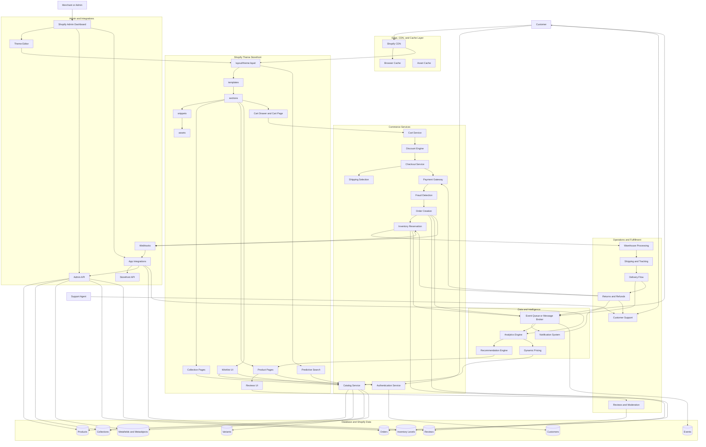
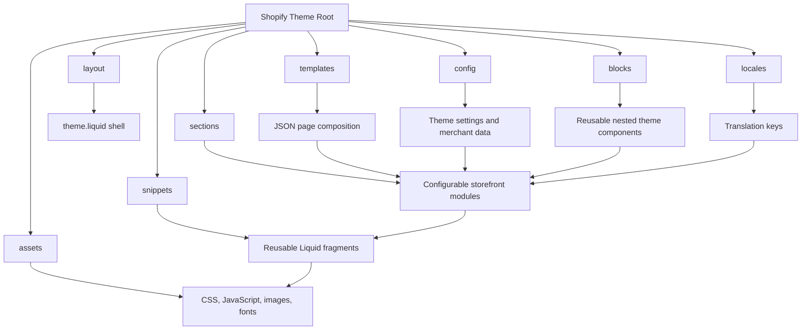
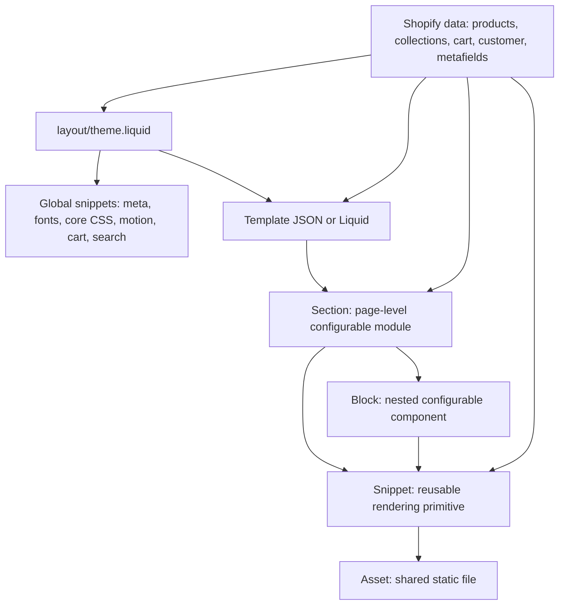
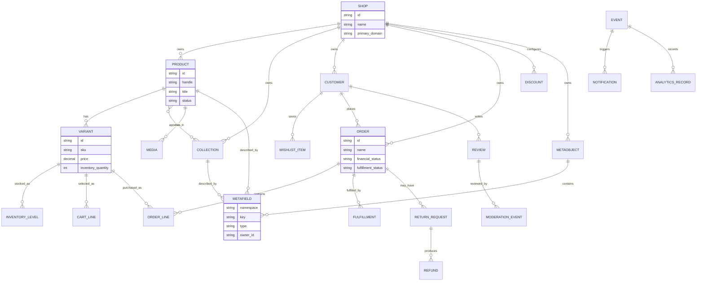

# Project Architecture

This directory is the source of truth for AI-assisted development in this Shopify e-commerce theme. Codex, Cursor, Claude Code, Cline, Roo Code, Antigravity, Copilot, and future agents should read this file before changing code and should update the relevant Mermaid diagrams whenever storefront flows, services, data relationships, integrations, or Shopify theme structure changes.

## Architecture Files

- [ecommerce-system.mmd](./ecommerce-system.mmd): complete storefront, commerce, service, and operations system map.
- [checkout-flow.mmd](./checkout-flow.mmd): cart, discount, checkout, payment, fraud, order, and notification flow.
- [admin-flow.mmd](./admin-flow.mmd): Shopify Admin, theme editor, app, moderation, support, and analytics flow.
- [inventory-flow.mmd](./inventory-flow.mmd): inventory reservation, warehouse processing, shipment, delivery, and restock flow.
- [recommendation-flow.mmd](./recommendation-flow.mmd): analytics, personalization, recommendation, and dynamic pricing flow.
- [returns-flow.mmd](./returns-flow.mmd): returns, refunds, support, inventory recovery, and moderation flow.
- [frontend-flow.mmd](./frontend-flow.mmd): storefront rendering flow.
- [backend-flow.mmd](./backend-flow.mmd): Shopify service and app boundary flow.
- [database-design.mmd](./database-design.mmd): core Shopify commerce data relationships.
- [implementation-notes.md](./implementation-notes.md): implementation map from Mermaid flows to code modules.

## Complete E-Commerce System

## Frontend, Backend, and Service Relationships

The storefront is a Shopify Liquid theme. It renders through `layout/theme.liquid`, page templates, sections, snippets, and assets. Frontend behavior should remain focused on rendering, interaction, progressive enhancement, cart UI, search UI, product discovery, and theme-editor-configurable components.

The backend is mostly Shopify-managed. Product catalogs, collections, variants, customer accounts, cart state, checkout, orders, payments, shipping, and metafields are platform services. Custom backend behavior belongs in isolated Shopify apps, app proxies, webhooks, message queues, or external services.

The API layer connects the two worlds. Liquid objects provide server-rendered commerce data. Ajax Cart API powers cart updates. Predictive Search API powers search. Storefront API may power client-side read flows. Admin API must be used only by authenticated backend apps and never exposed in theme JavaScript.

## Shopify Structure Mapping

## Scalable Liquid Component Hierarchy

Use this hierarchy when adding or refactoring storefront features:

## Database Relationships

Shopify owns the operational database. Theme code should render these objects instead of re-creating commerce state in custom JavaScript.

## Development Rules for AI Agents

- Read this file and the relevant `.mmd` file before generating code.
- Follow the Mermaid diagrams strictly unless the user explicitly requests an architecture change.
- Keep Shopify Liquid rendering modular through sections, snippets, templates, blocks, assets, layout, config, and locales.
- Reuse snippets and components before creating new ones.
- Keep business logic isolated from presentation: storefront code should not become an order, pricing, inventory, or admin service.
- Preserve existing naming conventions and theme editor configurability.
- Update Mermaid docs whenever frontend flow, checkout flow, inventory flow, recommendations, returns, analytics, integrations, or data relationships change.

## Implemented Module Map

| Architecture flow | Theme or app module |
| --- | --- |
| Storefront to wishlist | `snippets/product-card.liquid`, `assets/commerce-orchestrator.js`, `app/api/routes.ts` |
| Storefront to cart and checkout | `snippets/cart-drawer.liquid`, `sections/cart.liquid`, Shopify Ajax Cart API, Shopify Checkout |
| Storefront to recommendations | `sections/recommendation-engine.liquid`, `assets/commerce-orchestrator.js`, `app/services/commerce-services.ts` |
| Storefront to dynamic pricing | `snippets/product-card.liquid`, `assets/commerce-orchestrator.js`, `app/services/commerce-services.ts` |
| Reviews and moderation | `sections/review-system.liquid`, `app/database/schema.sql`, `app/api/routes.ts` |
| Returns and refunds | `sections/return-request.liquid`, `app/services/commerce-services.ts`, `app/database/schema.sql` |
| Shipping and tracking | `sections/order-tracking.liquid`, `app/api/routes.ts` |
| Customer authentication dashboard | `sections/customer-dashboard.liquid`, Shopify Customer Accounts |
| Admin analytics dashboard | `sections/admin-analytics-dashboard.liquid`, `app/api/routes.ts`, Shopify Admin app boundary |
| Event queue and notifications | `assets/commerce-orchestrator.js`, `app/api/routes.ts`, `app/services/commerce-services.ts` |
